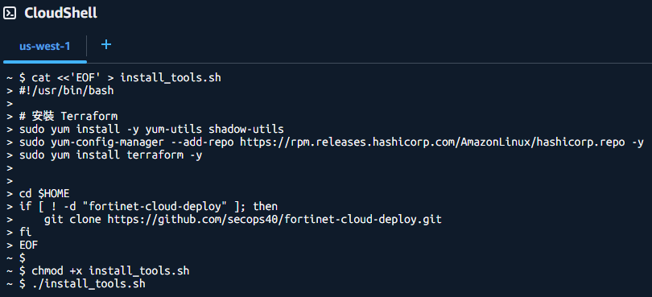

# AWS CloudShell 部署 FortiGate HA (Terraform) 指南

## 1. 準備工作 (Prerequisites)
1. **AWS 帳號權限**：具備 `AdministratorAccess` 或擁有 EC2、VPC、TGW、GWLB、S3 與 IAM 的管理權限。
2. **授權檔案**：若使用 BYOL 模式，請準備好 FortiGate 的 `.lic` 授權檔或 `token`。


## 2. 操作步驟 (Step-by-Step)
### 第一步：於指定 Region 啟動 AWS CloudShell
為了確保 Terraform 順利存取資源，請務必在目標 Region 啟動 CloudShell：
1. 登入 [AWS Console](https://console.aws.amazon.com/)。
2. **切換 Region**: 在頁面右上角的區域選單中，切換至您欲建置 FortiGate 的 Region (例如: 美西 `us-west-1`)。
3. **啟動 CloudShell**：點擊導覽列右上角的 **CloudShell 圖示 (>_)**。
    
4. **驗證環境**：確認 CloudShell 視窗下方的 Region 標籤顯示為您的目標區域。
    

### 第二步：建立並執行工具安裝腳本
* 在 CloudShell 視窗中直接貼上以下指令，這將自動安裝 Terraform 並下載專案代碼：
    ```
    cat <<'EOF' > install_tools.sh
    #!/usr/bin/bash

    # 安裝 Terraform
    sudo yum install -y yum-utils shadow-utils
    sudo yum-config-manager --add-repo https://rpm.releases.hashicorp.com/AmazonLinux/hashicorp.repo -y
    sudo yum install terraform -y


    cd $HOME
    if [ ! -d "fortinet-cloud-deploy" ]; then
        git clone https://github.com/secops40/fortinet-cloud-deploy.git
    fi
    EOF

    chmod +x install_tools.sh
    ./install_tools.sh
    ```
    
* 進入工作目錄
    ```
    cd $HOME/fortinet-cloud-deploy/aws/
    ```

## 💡重要技術提示 (Tips) 
### CloudShell 環境持久性說明
1. Terraform 程式: CloudShell 的系統環境在每次 Session 結束（或閒置過久）後會重置，這會導致 /usr/bin/terraform 消失。若發現無法執行 terraform，請重新執行下列指令，即可快速恢復環境:
    ```
    cd ~; ./install_tools.sh` 即可快速恢復環境。
    ```
2. `$HOME` 目錄: `/home/cloudshell-user` (包含 install_tools.sh 檔案及 fortinet-cloud-deploy 代碼目錄) 會永久保存 (上限 1GB)，因此不需要重新 git clone。

### 免金鑰認證
在 CloudShell 中執行時，請移除專案設定檔中的 access_key 與 secret_key 設定。
* 編輯 `terraform.tfvars`
    ```
    //access_key = "<AWS access key>"
    //secret_key = "<AWS secret key>"
    ```
* 編輯 `providers.tf`
    ```
    provider "aws" {
        //access_key = var.access_key
        //secret_key = var.secret_key
        region     = var.region
    }
    ```
* 編輯 `variables.tf`
    ```
    //variable "access_key" {}
    //variable "secret_key" {}
    ```

### FortiGate Debug
* sniffer packet
    ```
    diagnose sniffer packet any "host 10.1.1.10 and icmp" 4 100
    ```
    ```
    diagnose sniffer packet any "host 10.1.1.10 and (port 80 or port 443)" 4 100
    ```
* debug flow
    ```
    diagnose debug reset
    diagnose debug enable
    diagnose debug flow filter saddr 10.1.1.10
    diagnose debug flow show function-name enable
    diagnose debug flow trace start 100
    ```
    * disable debug
        ```
        diagnose debug disable
        diagnose debug reset
        ```