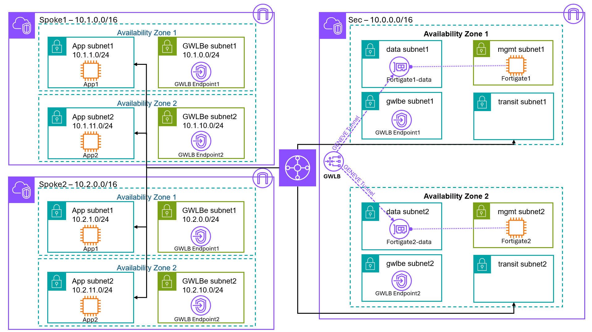
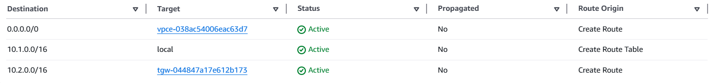
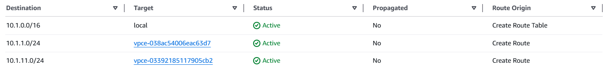
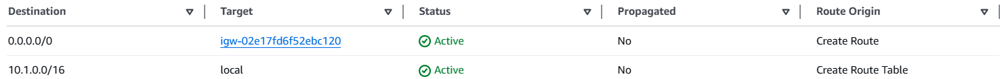
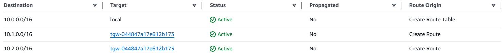

# AWS Transit Gateway + GWLB (FortiGate Cross-AZ Centralized North-South and East-West Inspection)
A Scalable FortiGate Architecture for North–South and East-West Inspection using AWS Transit Gateway and GWLB (Cross-AZ).



- **使用情境**  
  * 南北向 (N-S) 和 東西向 (E-W) 流量檢查。
  * 適用於需要集中式安全檢查與水平擴展 (Horizontal Scaling) 的多 VPC 環境。

- **流量處理**  
  * North-South 流量
    * **Ingress（進站流量）**: 從 Internet 進入 Spoke Vpc 內的 app 網段中的 Server，會先導向 GWLB，再經由 FortiGate 的 GENEVE 介面檢查，然後送回 GWLB。  
    * **Egress（出站流量）**: app 網段的 Server 流量送往 Internet，同樣會先導向 GWLB，再經由 FortiGate 的 GENEVE 介面檢查，最後回到 GWLB 出口。
  * East–West (VPC-to-VPC) 流量<br/>
    VPC 間流量經 Transit Gateway 轉送時，可強制導向 GWLB 進行集中式檢查，再回送至目標 VPC。

- **架構特點**  
  * 高度可擴展: 透過增加 FortiGate VM 即可水平擴充處理容量。
  * 跨 AZ 高可用性設計: GWLB 將流量分散至多個 AZ 中的 FortiGate，確保單一 AZ 或單一防火牆故障時，服務仍可持續運作。
  * 集中式安全檢查: 所有 N-S 與 E-W 流量統一經由 Sec VPC 檢查，簡化安全政策管理。
  * 使用 **GENEVE** 封裝技術，在雲端環境中保留完整流量內容，方便 FortiGate 進行檢查。
  * 手動擴展，無需 SNAT: 流量維持原始來源與目的位址，避免額外的 NAT 複雜度，利於稽核與追蹤。
  * **不支援 Session Failover**: 單一 FortiGate 發生故障時，既有連線會中斷，新連線將由 GWLB 轉送至健康的 FortiGate。

- **工具**  
  * 本部署使用 **_Terraform_** 工具

---

## 設定
### 編輯 terraform.tfvars
* 請複製 `terraform.tfvars.example` 為 `terraform.tfvars`, 並依照實際環境修改, 開始進行後續設定與編輯:
  ```
  // AWS Environment
  access_key = "<AWS access key>"
  secret_key = "<AWS secret key>"
  //token    = "<AWS session token>"

  // Provide a common tag prefix value that will be used in the name tag for all resources
  tag_name_prefix = "Test"

  // Provide the license type for FortiGate-VM Instances, either byol or payg
  license_type = "byol"
  licenses = ["license1.lic","license2.lic"]

  // FortiGate VM version to deploy
  fgt_version = "7.6.5"

  // Create Spoke Vpcs
  spokeVpc = "true"

  // Provide the region and availability zones to deploy the VPC in
  region = "us-west-1"
  availability_zone1 = "us-west-1a"
  availability_zone2 = "us-west-1c"

  // Provide a keypair for accessing the FortiGate instances
  keypair = "us-west-1"
  ```
   * 請將 FortiGate 版本更新為 AWS 上支援的最新版本。
      ```
      // FortiGate VM version to deploy
      fgt_version = "7.6.5"
      ```
   * 若不建 Spoke Vpcs
      ```
      // Create Spoke Vpcs
      spokeVpc = "false"
      ```
* 將 FortiGate **_license files_** 放置於專案目錄中.

### 修改 variables.tf 參數 (Optional)
* 授權格式 `license_format` 可選擇以下兩種：
   * **file**: FortiGate-VM License File
   * **token**: FortiFlex Token <br/>
      ⚠️ 即使使用 token，仍需將 Token 值存放於檔案中.
   ```
   variable "license_format" {
      default = "file"
   }
   ```
* 設定 Instance Type (依需求調整)
   ```
   // instance architect
   // Either arm or x86
   variable "arch" {
      default = "arm"
   }

   // instance type needs to match the architect
   // c5.xlarge is x86_64
   // c6g.xlarge is arm
   // For detail, refer to https://aws.amazon.com/ec2/instance-types/
   variable "instance_type" {
      description = "Provide the instance type for the FortiGate instances"
      default     = "c6gn.xlarge"
   }
   ```
* 設定 Subnet 網段 CIDR (依需求調整)
  ```
  // VPC for FortiGate Security VPC
  variable "vpccidr" {
    default = "10.0.0.0/16"
  }

  ...

  // VPC for Spoke1 VPC
  variable "csvpccidr" {
    default = "10.1.0.0/16"
  }

  ...


  // VPC for Spoke2 VPC
  variable "cs2vpccidr" {
    default = "10.2.0.0/16"
  }
  ```

## 使用 IAM Role / Instance Profile (不使用 Access Key)
* 將 access_key 與 secret_key 設定註解掉。
* 編輯 `terraform.tfvars`
   ```
   //access_key = "<AWS access key>"
   //secret_key = "<AWS secret key>"
   //token    = "<AWS session token>"
   ```
* 編輯 `providers.tf`
   ```
   provider "aws" {
      region     = var.region
      //access_key = var.access_key
      //secret_key = var.secret_key
   }
   ```
* 編輯 `variables.tf`
    ```
    //variable "access_key" {}
    //variable "secret_key" {}
    ```

## Terraform 部署
* 初始化 Terraform Provider 與 Module
   ```
   terraform init
   ```
* 產生並檢視執行計畫
   ```
   terraform plan
   ```
* 確認輸出內容是否符合預期
* 執行部署計畫
   ```
   terraform apply
   ```
* 當提示確認時，輸入 `yes`.

## 輸出資訊 (Output)
部署完成後，Terraform 將輸出以下資訊, 供您用來登入及管理 FortiGate VM 與相關資源:
```
FGT1_Password = <FortiGate1 Password>
FGT1_PublicIP = <FortiGate1 Public IP>
FGT2_Password = <FortiGate2 Password>
FGT2_PublicIP = <FortiGate2 Public IP>
GWLB_Endpoint_Service = <GWLB Endpoint Service Name>
GWLB_PrivateIP = <GWLB Endpoint1 IP>
GWLB_PrivateIP2 = <GWLB Endpoint2 IP>
Username = "admin"
```

## AWS 設定
* 若 `spokeVpc = "false"` 則需手動完成 Transit Gateway 和 Gateway Load Balancer (GWLB) 與現有 Spoke Vpc 整合設定
> 以上圖中 **Spoke1** 與 **Spoke2** 兩個 Vpc 為例，將其 North–South 和 East-West 流量導向 GWLB 進行 FortiGate 安全檢測 (Security Inspection)。

### Transit Gateway Attachments
1. 為現有 VPC 建立 Transit Gateway Attachment:
   - 建立 Spoke1-att → 連接 Spoke1 VPC  
   - 建立 Spoke2-att → 連接 Spoke2 VPC  
2. 設定建議:
    - Disable **Security Group Referencing Support**: 不要勾選
### Transit Gateway Route Tables
1. 建立 Spoke Route Table: **_Spoke-tgwy-rt_**
    * Create transit gateway route table
    * 關聯 (Associate):
        * Spoke1-att
        * Spoke2-att
    * 設定路由 (Routes)
        * `0.0.0.0/0` → 指向 Sec VPC Attachment (<tag_name_prefix>-tgwy-att-Sec)
2. 修改 Sec VPC Route Table: **_<tag_name_prefix>-Sec-tgwy-rt_**
    * 設定路由傳播 (Propagations)
        * Spoke1-att
        * Spoke2-att
    * 路由 (Routes)
        * 不需手動設定, aws 會自動生成
### Gateway Load Balancer Endpoints（GWLBe）
於 Spoke Vpc **每個 AZ** 中建立一個 GWLB Endpoint:
- 至 VPC - PrivateLink and Lattice - Endpoints
- Create endpoint - "<tag_name_prefix>-Spoke1-az1"
   * Service name: `<GWLB_Endpoint_Service>`
   * Vpc: `<Spoke1 Vpc>`
   * Subnet: `<Spoke1 Vpc - GWLBe Subnet1>`
- Create endpoint - "<tag_name_prefix>-Spoke1-az2"
   * Service name: `<GWLB_Endpoint_Service>`
   * Vpc: `<Spoke2 Vpc>`
   * Subnet: `<Spoke2 Vpc - GWLBe Subnet2>`
### VPC Route Tables
1. 修改 Spoke1 Vpc App Route Table
   
   * App Subnet1 Route Table:
      * Routes: 
         * `0.0.0.0/0` → 指向 Gateway Load Balancer Endpoint - az1
         * `<Spoke2 CIDR>` → 指向 Transit Gateway
      * Subnet associations
         * App Subnet1
   * App Subnet2 Route Table:
      * Routes: 
         * `0.0.0.0/0` → 指向 Gateway Load Balancer Endpoint - az2
         * `<Spoke2 CIDR>` → 指向 Transit Gateway
      * Subnet associations
         * App Subnet2
1. AppVpc GWLBe Subnet Route Table
   * 建立 Ingress Route Table:
      * Routes 
         
         * `10.1.0.0/16` → 指向 `local`
         * `10.1.1.0/24` → 指向 Gateway Load Balancer Endpoint - az1
         * `10.1.11.0/24` → 指向 Gateway Load Balancer Endpoint - az2
      * Edge assciations:
         * _igw-_
      * Subnet associations: **_不用設_**
   * Engress Route Table:
      * Routes 
         
         * `0.0.0.0` → 指向 _igw-_
      * Subnet associations:
         * GWLBe Subnet1
         * GWLBe Subnet2
1. 修改 Sec VPC Route Table: **_<tag_name_prefix>-Sec-gwlbe-rt_**
    
    * `10.1.0.0/24` → 指向 Transit Gateway
    * `10.2.0.0/24` → 指向 Transit Gateway

## FortiGate 設定

1. 登入 FortiGate 管理介面
2. 切換 VDOM 至 `FG-traffic` 做 Firewall Policy 管理
> ⚠️ 注意：兩台 FortiGate 為 Active/Active 獨立運作，Firewall Policy 需分別設定。


## 測試驗證
### Internet 連通測試
* 於 Spoke1 Vpc 的 App Subnet 中建立 EC2，並設定可對外連線的 Public IP。
* 可從外部 ssh 連入 EC2。
* 可由 Spoke1 EC2 連線到外部 Internet (例如 `ping 8.8.8.8` 或瀏覽網頁)。
* 可由 Spoke1 EC2 連線到 Spoke2 Vpc 中的 EC2。

---
# 刪除資源
> ⚠️ 注意：此動作會刪除所有由 Terraform 管理的資源，請務必確認無其他服務依賴。

在執行 `terraform destroy` 前，必須先刪除手動建立的的資源: 
## 手動刪除 Gateway Load Balancer Endpoints (GWLBe) 
1. <tag_name_prefix>-Spoke1-az1
2. <tag_name_prefix>-Spoke1-az2
3. <tag_name_prefix>-Spoke2-az1
4. <tag_name_prefix>-Spoke2-az2
## 手動刪除 Spoke VPC Attachment
1. Spoke1-att → Delete transit gateway attachment
2. Spoke2-att → Delete transit gateway attachment 

## 執行 Terraform Destroy
1. 初始化 Terraform (如尚未初始化)
    ```
    terraform init
    ```
2. 產生 Destroy 計畫
    ```
    terraform plan -destroy
    ```
3. 確認輸出內容是否符合預期
4. 執行刪除
    ```
    terraform destroy
    ```
    當提示確認時，輸入 `yes`

