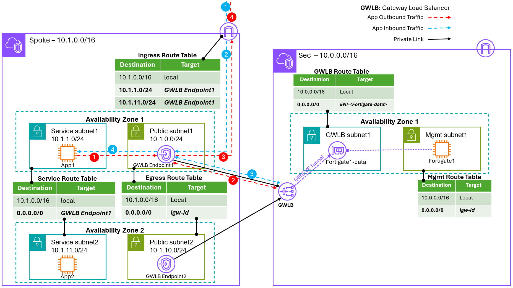
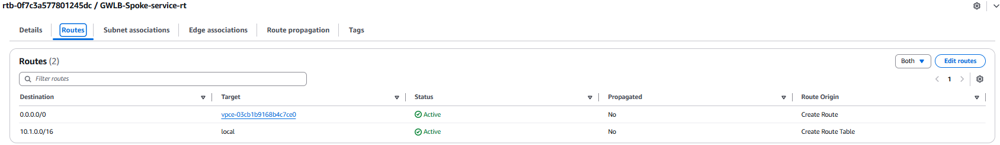
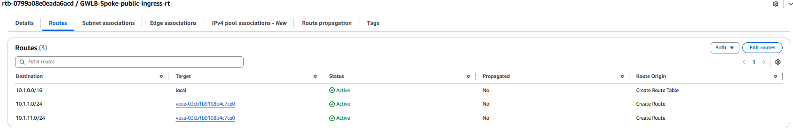
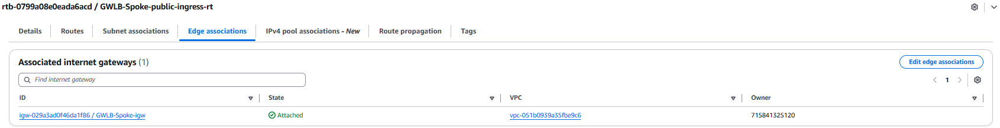
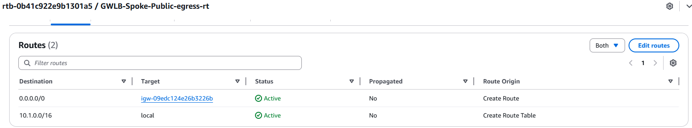

# AWS GWLB (FortiGate Single-AZ Centralized North-South Inspection)
A simplified FortiGate architecture for North–South traffic inspection using AWS Gateway Load Balancer (GWLB) in a Single Availability Zone deployment.



- **使用情境**  
  * 南北向 (N-S) 流量檢查。
  * 不需要跨 AZ 高可用（HA）的環境。
  * PoC、測試環境，或對成本與架構簡化有需求的生產環境。
  * 需要水平擴展 (Horizontal Scaling) 的環境。

- **流量處理**  
  * **Ingress（進站流量）**: 
      * Internet 流量進入 Service VPC。
      * 流量被導向 Single-AZ GWLB Endpoint。
      * GWLB 將流量轉送至 FortiGate，FortiGate 透過 GENEVE 介面進行安全檢查後，將流量送回 GWLB。
      * GWLB 再將流量轉送至 Service Subnet 內的 Server。  
  * **Egress（出站流量）**:
      * Service Subnet 內的 Server 對外流量先導向 GWLB Endpoint。
      * GWLB 將流量送往 FortiGate。
      * FortiGate 經由 GENEVE 介面檢查後，回送至 GWLB。
      * 流量最終由 GWLB 出口送往 Internet。

- **架構特點**
* 架構簡化
   * 僅部署於單一 Availability Zone，降低設計與維運複雜度。
   * 適合測試或不要求跨 AZ 容錯的場景。
* 可水平擴展
   * 可在同一 AZ 中新增 FortiGate，透過 GWLB 自動分流。
   * 無需調整應用端路由即可擴展處理能力。
* GENEVE 封裝
   * 使用 GENEVE 技術保留完整封包資訊（原始 IP、Port）。
   * FortiGate 可進行完整 L4–L7 安全檢查。
* 無需 SNAT
   * 流量原始來源 IP 得以保留，方便稽核與安全政策設計。
* 手動擴展
   * FortiGate 數量需由管理者手動調整。
   * 未整合 Auto Scaling Group（ASG）。
* 高可用性限制
   * 僅限單一 AZ，不具備跨 AZ HA 能力。
   * 不支援 Session Failover。
   * AZ 發生故障時，整體流量將中斷。

- **工具**  
  * 本部署使用 **_Terraform_** 工具

---

## 設定
### 編輯 terraform.tfvars
* 請複製 `terraform.tfvars.example` 為 `terraform.tfvars`, 並依照實際環境修改, 開始進行後續設定與編輯:
   ```
   // AWS Environment
   access_key = "<AWS access key>"
   secret_key = "<AWS secret key>"

   // Provide a common tag prefix value that will be used in the name tag for all resources
   // tag_name_prefix = ""

   // Provide the license type for FortiGate-VM Instances, either byol or payg
   license_type = "byol"
   licenses = ["license1.lic",""]

   // FortiGate VM version to deploy
   fgt_version = "7.6.5"

   // Create SpokeVpc
   spokeVpc = "true"

   // Provide the region and availability zones to deploy the VPC in
   region = "us-west-1"
   availability_zone1 = "us-west-1a"
   availability_zone2 = "us-west-1c"

   // Provide a keypair for accessing the FortiGate instances
   keypair = "us-west-1"
   ```
   * 請將 FortiGate 版本更新為 AWS 上支援的最新版本。
      ```
      // FortiGate VM version to deploy
      fgt_version = "7.6.5"
      ```
   * 若不建 Spoke Vpc
      ```
      // Create SpokeVpc
      spokeVpc = "false"
      ```
* 將 FortiGate **_license files_** 放置於專案目錄中.

### 修改 variables.tf 參數 (Optional)
* 授權格式 `license_format` 可選擇以下兩種：
   * **file**: FortiGate-VM License File
   * **token**: FortiFlex Token <br/>
      ⚠️ 即使使用 token，仍需將 Token 值存放於檔案中.
   ```
   variable "license_format" {
      default = "file"
   }
   ```
* 設定 Instance Type (依需求調整)
   ```
   // instance architect
   // Either arm or x86
   variable "arch" {
      default = "arm"
   }

   // instance type needs to match the architect
   // c5.xlarge is x86_64
   // c6g.xlarge is arm
   // For detail, refer to https://aws.amazon.com/ec2/instance-types/
   variable "instance_type" {
      description = "Provide the instance type for the FortiGate instances"
      default     = "c6gn.xlarge"
   }
   ```
* 設定 Subnet 網段 CIDR (依需求調整)
   ```
   // VPC for FortiGate Security VPC
   variable "vpccidr" {
   default = "10.0.0.0/16"
   }

   ...

   // VPC for Spoke VPC
   variable "csvpccidr" {
   default = "10.1.0.0/16"
   }

   ...

   ```

## 使用 IAM Role / Instance Profile (不使用 Access Key)
* 將 access_key 與 secret_key 設定註解掉。
* 編輯 `terraform.tfvars`
   ```
   //access_key = "<AWS access key>"
   //secret_key = "<AWS secret key>"
   //token    = "<AWS session token>"
   ```
* 編輯 `providers.tf`
   ```
   provider "aws" {
      region     = var.region
      //access_key = var.access_key
      //secret_key = var.secret_key
   }
   ```
* 編輯 `variables.tf`
    ```
    //variable "access_key" {}
    //variable "secret_key" {}
    ```

## Terraform 部署
* 初始化 Terraform Provider 與 Module
   ```
   terraform init
   ```
* 產生並檢視執行計畫
   ```
   terraform plan
   ```
* 確認輸出內容是否符合預期
* 執行部署計畫
   ```
   terraform apply
   ```
* 當提示確認時，輸入 `yes`.

## 輸出資訊 (Output)
部署完成後，Terraform 將輸出以下資訊, 供您用來登入及管理 FortiGate VM 與相關資源:
```
FGT1_Password = <FortiGate1 Password>
FGT1_PublicIP = <FortiGate1 Public IP>
GWLB_Endpoint_Service = <GWLB Endpoint Service Name>
GWLB_PrivateIP-az1 = <GWLB Endpoint1 IP>
SecVpc = <SecVpc VpcId>
SpokeVpc = <SpokeVpc VpcId>
Username = "admin"
```

## AWS 設定
* 若 `spokeVpc = "false"` 則需手動完成 Gateway Load Balancer (GWLB) 與現有 Spoke Vpc 整合設定
> 以上圖中 **Spoke Vpc** 為例，將 Spoke Vpc 的 North–South 流量導向 GWLB 進行 FortiGate 安全檢測 (Security Inspection)。

### Gateway Load Balancer Endpoints（GWLBe）
於 Spoke Vpc 建立一個 GWLB Endpoint:
- 至 VPC - PrivateLink and Lattice - Endpoints
- Create endpoint - "GWLB-gwlb-Spoke-az1"
   * Service name: `<GWLB_Endpoint_Service>`
   * Vpc: `<SpokeVpc>`
   * Subnet: `<Spoke - GWLBe Subnet1>`
### VPC Route Tables
1. 修改 Spoke Vpc Service Route Table
   
   * Service Route Table:
      * Routes: 
         * `0.0.0.0/0` → 指向 `Gateway Load Balancer Endpoint - az1`
      * Subnet associations
         * Service Subnet1
         * Service Subnet2
1. Spoke Vpc Public Subnet Route Table
   * 建立 Ingress Route Table:
      * Routes 
         
         * `10.1.0.0/16` → 指向 `local`
         * `10.1.1.0/24` → 指向 `Gateway Load Balancer Endpoint - az1`
         * `10.1.11.0/24` → 指向 `Gateway Load Balancer Endpoint - az1`
      * Edge assciations:
         
         * `igw-id`
      * Subnet associations: **_不用設_**
   * Engress Route Table:
      * Routes 
         
         * `0.0.0.0` → 指向 `igw-id`
      * Subnet associations:
         * Public Subnet1
         * Public Subnet2

## FortiGate 設定

1. 登入 FortiGate 管理介面
2. 切換 VDOM 至 `FG-traffic` 做 Firewall Policy 管理
> ⚠️ 注意：兩台 FortiGate 為 Active/Active 獨立運作，Firewall Policy 需分別設定。


## 測試驗證
### Internet 連通測試
* 於 Spoke Vpc 的 Service Subnet 中建立 EC2，並設定可對外連線的 Public IP。
* 可從外部 ssh 連入 EC2。
* 可由 EC2 連線到外部 Internet (例如 `ping 8.8.8.8` 或瀏覽網頁)。

---
# 刪除資源
> ⚠️ 注意：此動作會刪除所有由 Terraform 管理的資源，請務必確認無其他服務依賴。
## 先刪除 Gateway Load Balancer Endpoints (GWLBe) 
在執行 `terraform destroy` 前，必須先刪除手動建立的的資源: 
1. GWLB-gwlb-Spoke-az1

## 執行 Terraform Destroy
1. 初始化 Terraform (如尚未初始化)
    ```
    terraform init
    ```
2. 產生 Destroy 計畫
    ```
    terraform plan -destroy
    ```
3. 確認輸出內容是否符合預期
4. 執行刪除
    ```
    terraform destroy
    ```
    當提示確認時，輸入 `yes`

