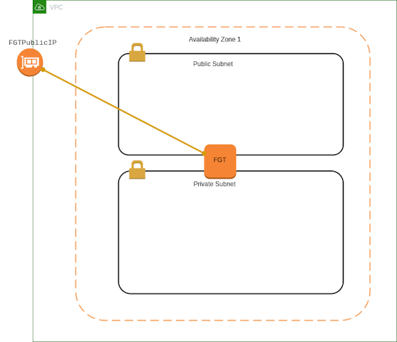

# AWS Single-AZ VPC (Standalone FortiGate)



- 上圖為 **單一 AZ VPC 架構，FortiGate 保護同 VPC 內的主機。**
- 本部署使用 **_Terraform_** 工具

---

## 設定
### 編輯 terraform.tfvars
* 請複製 `terraform.tfvars.example` 為 `terraform.tfvars`, 並依照實際環境修改, 開始進行後續設定與編輯:
   ```
   // AWS Environment
   access_key = "<AWS access key>"
   secret_key = "<AWS secret key>"

   // Provide a common tag prefix value that will be used in the name tag for all resources
   // tag_name_prefix = ""

   // Provide the license type for FortiGate-VM Instances, either byol or payg
   license_type = "byol"
   license = "license1.lic"

   // FortiGate VM version to deploy
   fgt_version = "7.6.5"

   // Provide the region and availability zones to deploy the VPC in
   region = "us-west-1"
   availability_zone1 = "us-west-1a"

   // Provide a keypair for accessing the FortiGate instances
   keypair = "us-west-1"
   ```
    * 請將 FortiGate 版本更新為 AWS 上支援的最新版本。
        ```
        // FortiGate VM version to deploy
        fgt_version = "7.6.5"
        ```
* 將 FortiGate **_license file_** 放置於專案目錄中.
* 若使用 `payg`, 請將 license file 設為空白檔案.

### 修改 variables.tf 參數 (Optional)
* 授權格式 `license_format` 可選擇以下兩種：
    * **file**: FortiGate-VM License File
    * **token**: FortiFlex Token <br/>
            ⚠️ 即使使用 token，仍需將 Token 值存放於檔案中.
    ```
    variable "license_format" {
        default = "file"
    }
    ```
* 設定 Instance Type (依需求調整)
    ```
    // instance architect
    // Either arm or x86
    variable "arch" {
        default = "arm"
    }

    // instance type needs to match the architect
    // c5.xlarge is x86_64
    // c6g.xlarge is arm
    // For detail, refer to https://aws.amazon.com/ec2/instance-types/
    variable "instance_type" {
        description = "Provide the instance type for the FortiGate instances"
        default     = "c6g.large"
    }
    ```
* 設定 Subnet 網段 CIDR (依需求調整)
   ```
   variable "vpccidr" {
   default = "10.0.0.0/16"
   }

   variable "publiccidraz1" {
   default = "10.0.0.0/24"
   }

   variable "privatecidraz1" {
   default = "10.0.1.0/24"
   }   
   ```
* 指定 AMI Id (用於指定舊版 FortiGate Version)
   ```
   locals {
   //ami_id = data.aws_ami.fgt_ami.id
   ami_id = "<ami_id>"
   }
   ```

## 使用 IAM Role / Instance Profile (不使用 Access Key)
* 將 access_key 與 secret_key 設定註解掉。
* 編輯 `terraform.tfvars`
    ```
    //access_key = "<AWS access key>"
    //secret_key = "<AWS secret key>"
    ```
* 編輯 `providers.tf`
    ```
    provider "aws" {
        //access_key = var.access_key
        //secret_key = var.secret_key
        region     = var.region
    }
    ```
* 編輯 `variables.tf`
    ```
    //variable "access_key" {}
    //variable "secret_key" {}
    ```

## Terraform 部署
* 初始化 Terraform Provider 與 Module
    ```
    terraform init
    ```
* 產生並檢視執行計畫
    ```
    terraform plan
    ```
* 確認輸出內容是否符合預期
* 執行部署計畫
    ```
    terraform apply
    ```
* 當提示確認時，輸入 `yes`.

## 輸出資訊 (Output)
部署完成後，Terraform 將輸出以下資訊, 供您用來登入及管理 FortiGate VM 與相關資源:
```
FGTPublicIP = <FGT Public IP>
Password = <FGT Password>
Username = <FGT Username>
```

---
# 刪除資源
> ⚠️ 注意：此動作會刪除所有由 Terraform 管理的資源，請務必確認無其他服務依賴。
 
## 執行 Terraform Destroy
1. 初始化 Terraform (如尚未初始化)
    ```
    terraform init
    ```
2. 產生 Destroy 計畫
    ```
    terraform plan -destroy
    ```
3. 確認輸出內容是否符合預期
4. 執行刪除
    ```
    terraform destroy
    ```
    當提示確認時，輸入 `yes`
