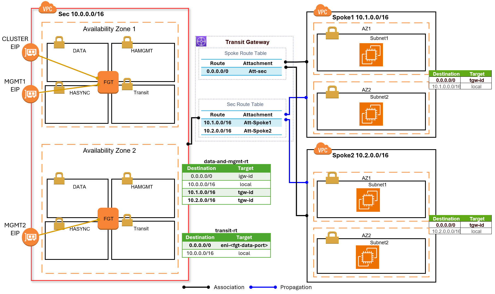
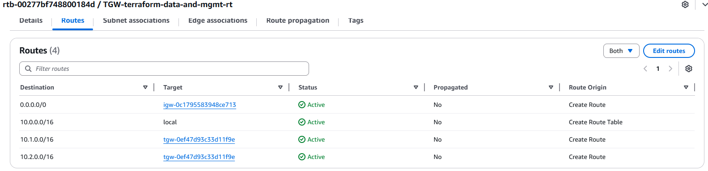
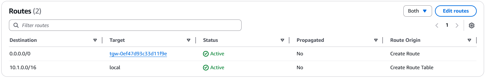
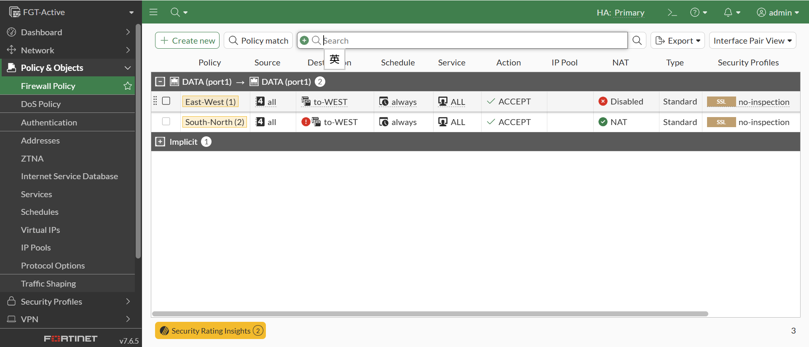
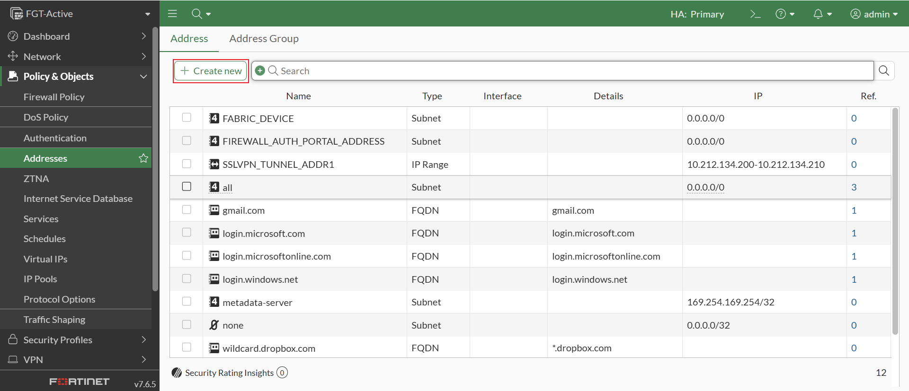
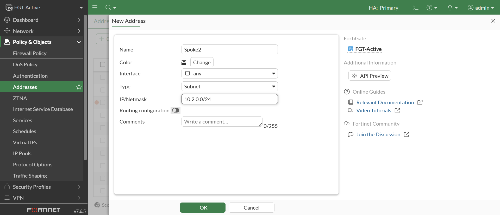
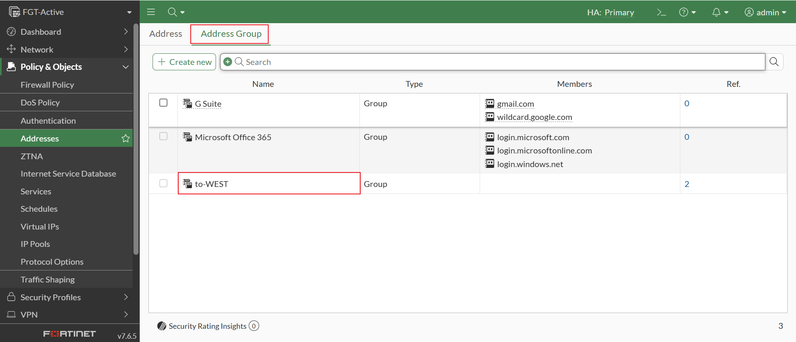
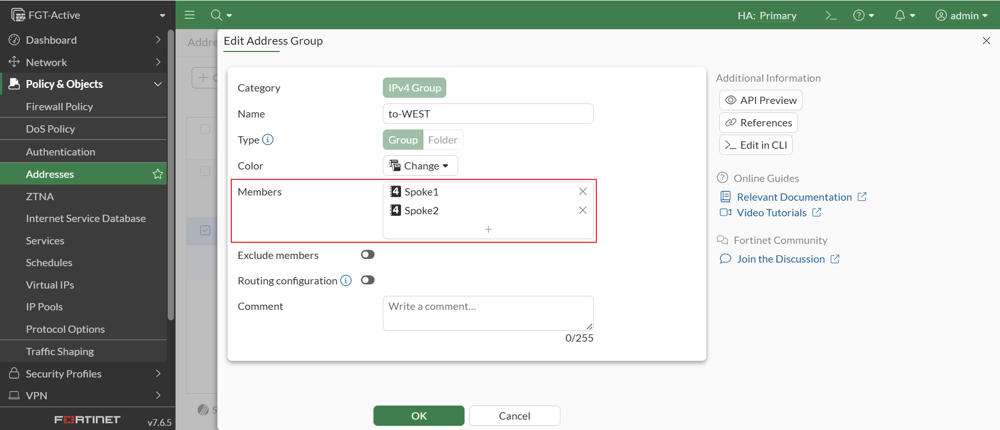
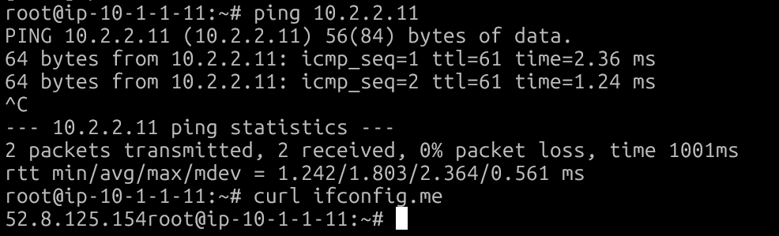

# AWS Transit Gateway (FortiGate A-P HA)



- 上圖為 **Active-Passive、Multi-AZ 的 FortiGate HA 架構**
- 本部署使用 **_Terraform_** 工具
- 部署範圍**僅包含 Security VPC 與 AWS Transit Gateway**
  - **不包含任何 Client / Spoke VPC 的建立**
  - 若需要包含 Spoke VPC 的完整測試情境，請參考官方範例：  
    👉 [AWS Transit Gateway scenario with Terraform](https://github.com/fortinet/fortigate-terraform-deploy/tree/main/aws/7.6/transitgwy)

---

## 設定
### 編輯 terraform.tfvars
* 請複製 `terraform.tfvars.example` 為 `terraform.tfvars`, 並依照實際環境修改, 開始進行後續設定與編輯:
    ```
    // AWS Environment
    access_key = "<AWS access key>"
    secret_key = "<AWS secret key>"
    //token    = "<AWS session token>"

    // Provide a common tag prefix value that will be used in the name tag for all resources
    tag_name_prefix = "Test"

    // Provide the license type for FortiGate-VM Instances, either byol or payg
    license_type = "byol"
    licenses = ["license1.lic","license2.lic"]

    // password for FortiGate HA configuration
    password = "Foritnet1!"

    // FortiGate VM version to deploy
    fgt_version = "7.6.5"

    // Create SpokeVpc
    spokeVpc = "true"

    // Provide the region and availability zones to deploy the VPC in
    region = "us-west-1"
    availability_zone1 = "us-west-1a"
    availability_zone2 = "us-west-1c"

    // Provide a keypair for accessing the FortiGate instances
    keypair = "us-west-1"
    ```
    * 請將 FortiGate 版本更新為 AWS 上支援的最新版本。
        ```
        // FortiGate VM version to deploy
        fgt_version = "7.6.5"
        ```
    * 若不建 Spoke Vpc
        ```
        // Create SpokeVpc
        spokeVpc = "false"
        ```
* 將 FortiGate **_license files_** 放置於專案目錄中.

### 修改 variables.tf 參數 (Optional)
* 授權格式 `license_format` 可選擇以下兩種：
    * **file**: FortiGate-VM License File
    * **token**: FortiFlex Token <br/>
            ⚠️ 即使使用 token，仍需將 Token 值存放於檔案中.
    ```
    variable "license_format" {
        default = "file"
    }
    ```
* 設定 Instance Type (依需求調整)
    ```
    // instance architect
    // Either arm or x86
    variable "arch" {
        default = "arm"
    }

    // instance type needs to match the architect
    // c5.xlarge is x86_64
    // c6g.xlarge is arm
    // For detail, refer to https://aws.amazon.com/ec2/instance-types/
    variable "instance_type" {
        description = "Provide the instance type for the FortiGate instances"
        default     = "c6g.xlarge"
    }
    ```
* 設定 Subnet 網段 CIDR (依需求調整)
    ```
    # References to your Networks
    # security VPC
    variable "security_vpc_cidr" {
        description = "Provide the network CIDR for the VPC"
        default     = "10.0.0.0/16"
    }

    #### data subnets
    variable "security_vpc_data_subnet_cidr1" {
        description = "Provide the network CIDR for the data subnet1 in security vpc"
        default     = "10.0.1.0/24"
    }

    ...
    
    ```
* 指定 AMI Id (用於指定舊版 FortiGate Version)
    ```
    locals {
    //ami_id = data.aws_ami.fgt_ami.id
    ami_id = "<ami_id>"
    }
    ```

## 使用 IAM Role / Instance Profile (不使用 Access Key)
* 將 access_key 與 secret_key 設定註解掉。
* 編輯 `terraform.tfvars`
    ```
    //access_key = "<AWS access key>"
    //secret_key = "<AWS secret key>"
    ```
* 編輯 `providers.tf`
    ```
    provider "aws" {
        //access_key = var.access_key
        //secret_key = var.secret_key
        region     = var.region
    }
    ```
* 編輯 `variables.tf`
    ```
    //variable "access_key" {}
    //variable "secret_key" {}
    ```

## Terraform 部署
* 初始化 Terraform Provider 與 Module
    ```
    terraform init
    ```
* 產生並檢視執行計畫
    ```
    terraform plan
    ```
* 確認輸出內容是否符合預期
* 執行部署計畫
    ```
    terraform apply
    ```
* 當提示確認時，輸入 `yes`.

## 輸出資訊 (Output)
部署完成後，Terraform 將輸出以下資訊, 供您用來登入及管理 FortiGate VM 與相關資源:
```
FGT_Active_MGMT_Public_IP = <Active FGT Management Public IP>
FGT_Cluster_Public_IP = <Cluster Public IP>
FGT_Passive_MGMT_Public_IP = <Passive FGT Management Public IP>
FGT_Password = <FGT Password>
FGT_Username = <FGT admin>
TransitGwy_ID = <Transit Gwy ID>
```

## AWS 設定
Transit Gateway 與現有 Spoke VPC 整合
> 以上圖中 **Spoke1** 與 **Spoke2** 為例，說明如何在現有環境中完成 Transit Gateway 與 VPC 的整合設定。

### Transit Gateway Attachments
1. 為現有 VPC 建立 Transit Gateway Attachment:
   - 建立 Spoke1-att → 連接 Spoke1 VPC  
   - 建立 Spoke2-att → 連接 Spoke2 VPC  
2. 設定建議:
    - Disable **Security Group Referencing Support**: 不要勾選
### Transit Gateway Route Tables
1. 建立 Spoke Route Table: **_Spoke-RT_**
    * Create transit gateway route table
    * 關聯 (Associate):
        * Spoke1-att
        * Spoke2-att
    * 設定路由 (Routes)
        * `0.0.0.0/0` → 指向 Security VPC Attachment (<tag_name_prefix>-att-vpc_sec)
2. 修改 Security VPC Route Table: **_<tag_name_prefix>-VPC-SEC-RT_**
    * 設定路由傳播 (Propagations)
        * Spoke1-att
        * Spoke2-att
    * 路由 (Routes)
        * 不需手動設定, aws 會自動生成
### VPC Route Tables
1. 修改 Security VPC Route Table: **_<tag_name_prefix>-TGW-terraform-data-and-mgmt-rt_**
    
    * `10.1.0.0/24` → 指向 Transit Gateway
    * `10.2.0.0/24` → 指向 Transit Gateway
1. 修改 Spoke1 Route Table
    
    * `0.0.0.0/0` → 指向 Transit Gateway
1. 修改 Spoke2 Route Table
    * `0.0.0.0/0` → 指向 Transit Gateway

## FortiGate 設定

1. 登入 FortiGate 管理介面  
2. 前往 **Policy & Objects** → **Addresses** → **Address**
    
     
3. 新增 Address:`Spoke1`
    * 點選 `Create new`
    * 設定：
        - Name: `Spoke1`  
        - Type: `Subnet`
        - IP/Netmask: `10.1.0.0/24`
4. 新增 Address:`Spoke2`
    * 點選 `Create new`
    * 設定：
        - Name: `Spoke2`  
        - Type: `Subnet`
        - IP/Netmask: `10.2.0.0/24` 
3. 將 Address 加入既有 Address Group: `to-WEST`
    
    
    * 前往 **Address Group** → `to-WEST` → **Edit**: 在 **Members** 欄位中，新增
        - `Spoke1`  
        - `Spoke2`

## 測試驗證

### 跨 Spoke VPC 連通測試
* 從 **Spoke1** 的任意 EC2, 執行 ping 測試至 **Spoke2** 任意可用 IP.
* 從 **Spoke2** 的任意 EC2, 執行 ping 測試至 **Spoke1** 任意可用 IP.
### Internet 連通測試
* 從 **Spoke1** 的 EC2, 可連線到外部 Internet (例如 `ping 8.8.8.8` 或瀏覽網頁).
* 從 **Spoke2** 的 EC2，執行相同的連線測試.

---
# 刪除資源
> ⚠️ 注意：此動作會刪除所有由 Terraform 管理的資源，請務必確認無其他服務依賴。
## 先刪除 Spoke VPC Attachment
在執行 `terraform destroy` 前，必須先刪除 TGW 與 Spoke 的 Attachment：
1. Spoke1-att → Delete transit gateway attachment
2. Spoke2-att → Delete transit gateway attachment 

## 執行 Terraform Destroy
1. 初始化 Terraform (如尚未初始化)
    ```
    terraform init
    ```
2. 產生 Destroy 計畫
    ```
    terraform plan -destroy
    ```
3. 確認輸出內容是否符合預期
4. 執行刪除
    ```
    terraform destroy
    ```
    當提示確認時，輸入 `yes`
