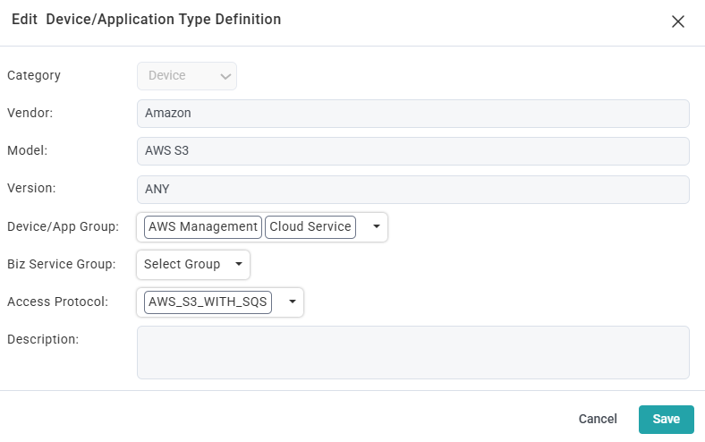
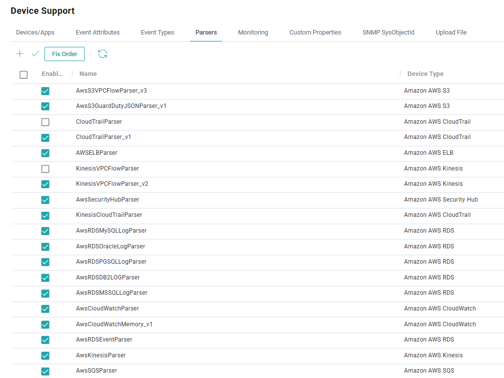

# AWS CloudTrail to FortiSIEM Integration

This project deploys a secure AWS infrastructure to capture CloudTrail logs and stream them to FortiSIEM via SQS. You can choose to deploy using **Terraform** or **AWS CloudFormation**.

---

## 1. CloudFormation Deployment

### Quick Start
1. Go to the AWS CloudFormation Console.
2. Select **Create stack** (With new resources) -> **Upload a template file**.
3. Upload `cloudformation.yml` and provide the required parameters (e.g., `Prefix`).
4. Acknowledge IAM resource creation and click **Submit**.

---

## 2. Terraform Deployment

### Prerequisites
- **Terraform**: Ensure [Terraform](https://www.terraform.io/downloads.html) is installed.
- **AWS CLI**: Configure your environment with `aws configure`.

### Step 1: Configure Variables
Copy the example variables file and modify it with your desired values:
```bash
cp terraform.tfvars.example terraform.tfvars
```
*Open `terraform.tfvars` in your editor and set your `prefix` and other optional variables before proceeding.*

### Step 2: Initialize
Initialize the working directory:
```bash
terraform init
```

### Step 3: Plan & Deploy
Review the resources to be created and apply the configuration:
```bash
terraform plan
terraform apply
```
* Alternatively, Skip Step 1 and pass variables directly via the command line:
    ```bash
    terraform apply -var="prefix=fs-prod" -var="enable_kms=true" -var="log_retention_days=30"
    ```
*(Type `yes` to confirm when prompted)*

### Step 4: Get Secret Key
```
terraform output -json fortisiem_aws_secret_key
```

### Cleanup
To destroy all created resources:
```bash
terraform destroy
```

---

## 3. Post-Deployment (Outputs)

Regardless of the deployment method chosen, the resulting infrastructure will output the exact details required to configure your FortiSIEM application:

*   **`FortiSIEMIAMUserName`**: The IAM user created.
*   **`FortiSIEMAccessKey`**: Credentials required for FortiSIEM setup.
*   **`FortiSIEMSecretKey`**: Credentials required for FortiSIEM setup.
*   **`FortiSIEMS3Bucket`**: The S3 bucket where CloudTrail logs are stored.
*   **`FortiSIEMRegion`**: The AWS region of the SQS bucket.
*   **`FortiSIEMSQSQueueUrl`**: The SQS URL for FortiSIEM.

---

## 4. SQS Access Policy for S3 Integration (Optional)

If you plan to configure S3 Event Notifications to send messages directly to this SQS queue (e.g., for VPC Flow Logs or GuardDuty logs written to S3), you must manually append the following statement to your SQS Access Policy. 

This grants the S3 service permission to publish messages to the queue:

```json
{
  "Sid": "AwsS3Access",
  "Effect": "Allow",
  "Principal": "*",
  "Action": "sqs:SendMessage",
  "Resource": "*",
  "Condition": {
    "ArnEquals": {
      "aws:SourceArn": "arn:aws:s3:::<bucket_name>"
    }
  }
}
```
> **Note**: Remember to replace `<bucket_name>` with your actual S3 bucket name.

---

## 5. Add FortiSIEM Device/Application Type Definition

To ensure the `AWS S3` model is available for log collection, navigate to **Admin > Device Support** in the FortiSIEM GUI. If it does not already exist, add a new **Device/Application Type Definition** using the following settings:

*   **Model**: `AWS S3`
*   **Version**: `ANY`
*   **Device/App Group**: `AWS Management`, `Cloud Service`
*   **Access Protocol**: `AWS_S3_WITH_SQS`
    

---

## 6. FortiSIEM Configuration Reference

When configuring credentials and log collection in the FortiSIEM GUI, use the following mappings for specific AWS services to ensure proper log parsing:

| AWS Service | FortiSIEM Device Type | FortiSIEM Log Keyword |
| :--- | :--- | :--- |
| **VPC Flow Logs** | `Amazon AWS S3` | `AWS_S3_LOG_VPCFLOW-<REGION>` |
| **GuardDuty** | `Amazon AWS S3` | `AWS_S3_LOG_GUARDDUTY` |

> **Note**: For VPC Flow Logs, replace `<REGION>` with your target AWS region (e.g., `AWS_S3_LOG_VPCFLOW-ap-east-2`)

---

## 7. Custom Parsers (Optional)

The  directory in this repository contains custom parser configurations designed to handle specific AWS log formats. If required for your environment, you can manually add these to FortiSIEM.

**To add a custom parser:**
1. In the FortiSIEM GUI, navigate to **Admin > Device Support > Parsers**.
2. Click **+** to create a new parser entry.
3. Copy and paste the XML content from the respective file in the `parser/` directory into the parser configuration window.
4. Click **Save** to apply the changes.
5. Follow the configuration order and settings as shown in the below image.
    
